# HW 1: Assembly + Intro to ROS

## Summary

In this assignment you will:

1. Assemble and test your robot
2. Install software dependencies
3. Run your first ROS node on the robot
4. Practice writing your own publishers and subscribers

Place all screenshot deliverables in the [`writeup/`](./writeup/) directory alongside [`writeup/writeup.md`](./writeup/writeup.md).

> If you are new to VSCode markdowns, you can preview the markdown by clicking the "Open as Preview" button in the top right corner of the editor window. You can also use the keyboard shortcut `Ctrl/CMD+Shift V`.

## Q1 Assembly

Robot kits are available in Gates G23 for **pickup on Thursday September 3**. 

We will be collecting robots in G23 on **Tuesday September 8** for inspection of correct assembly. **You must bring your robot during this window to receive points for this portion.** 

You will be able to pick up the robot on **Thursday September 10** to continue this assignment (**due September 18th**)

Complete the "Getting Started" section of the [Mote documentation](https://empriselab.github.io/mote/). Be extra careful with the parts, we do not have spares!

> Note: You can skip the Hello World section (if you want to run the demo, you'll have to clone the [Mote Repo](https://github.com/empriselab/mote))

> Note 2: **You shouldn't be trying to assemble the wheels.** Don't worry, the TAs will drill the wheels in for you during the inspection. 

> Note 3: Each kit includes extra parts (pictured below). Keep them in your kit to return at the end of the semester, but they are unnecessary for this course.

> Note 4: Make sure that the number your box matches the number on the tailrunner (a 3D printed part on the back of the bot) included in the box. If you are missing any parts, please reach out to the TAs for help.

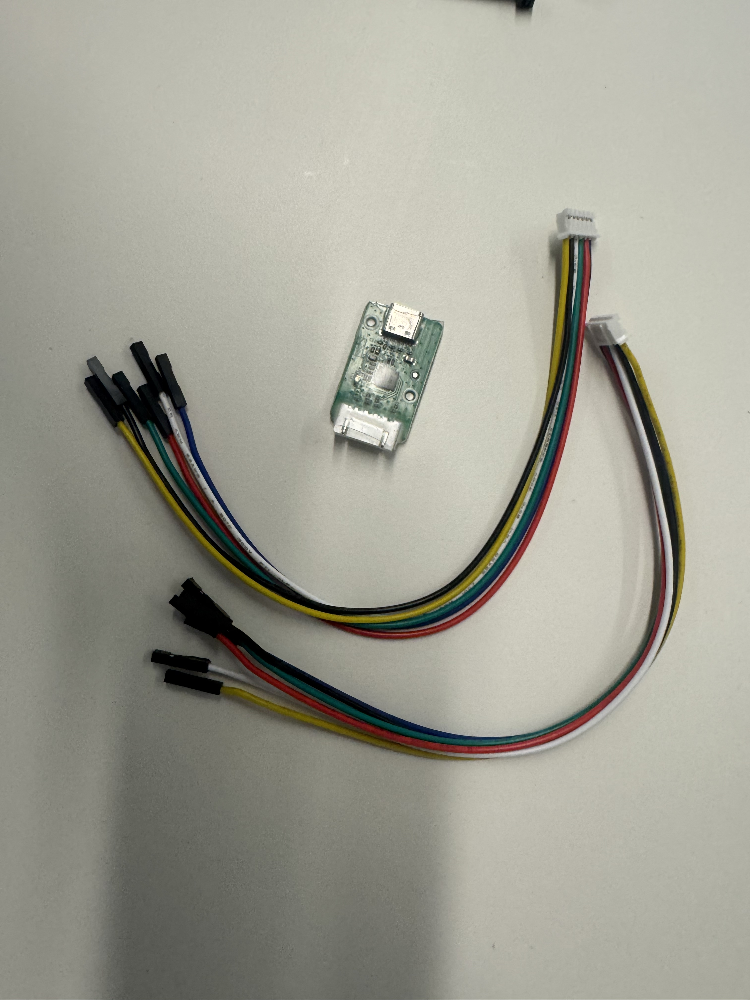

**(20 pts) Deliverable 1 Passing assembly inspection:** TAs will be manually checking for correct assembly and running teleop.

**(5 pts) Deliverable 2 Mote Configuration Page Screenshot:** Take a screenshot of the configuration page after connecting to the robot. Make sure you are using RedRover for Wifi and all items under diagnostics are checked. Note, for RedRover there is no password so just press enter and you may need to wait for a few minutes.

Save this screenshot in [Deliverable 2 in `writeup.md`](./writeup/writeup.md#deliverable-2-mote-configuration-page).

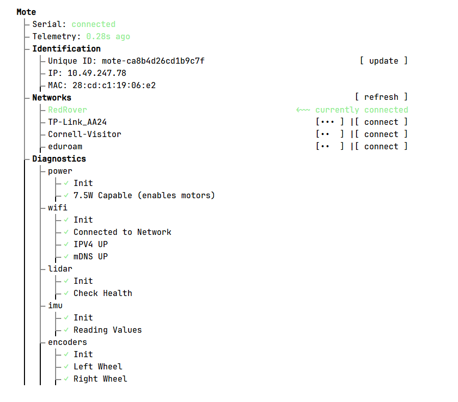

After connecting the robot to RedRover, you should switch your own computer to RedRover as well so they can communicate.

> **Note:** You can also connect to the robot with any other WiFi network, should you choose to work off campus.

> **Potential Issues:**
> <details>
> <summary>Unable to connect robot to RedRover</summary>
>
> If you see the following error on the configuration page:
>
> 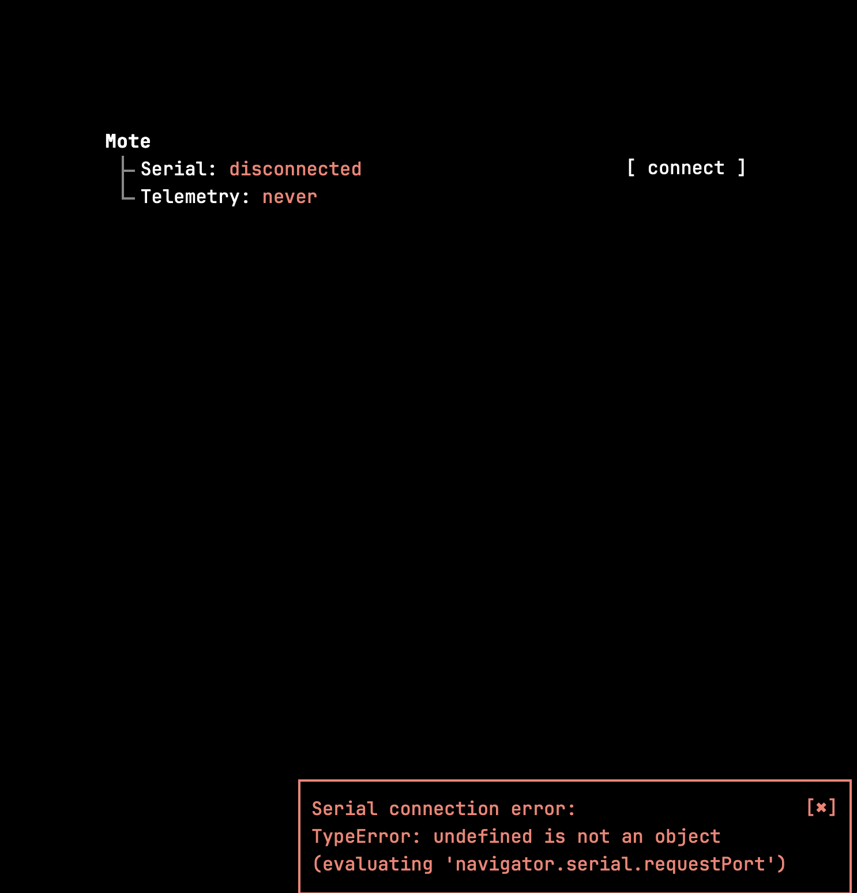
>
> You may need to reflash the firmware on the robot by dragging the `.uf2` file again as described in the [Mote documentation](https://empriselab.github.io/mote/getting_started/updating.html). If you are still unable to connect, please reach out to the TAs for help.
>
> </details>
>
> <details>
> <summary>Unable to connect computer to RedRover</summary>
>
> You may need to restart your computer or wait a few minutes if this is your first time connecting to RedRover.
>
> </details>


## Q2 Running a ROS node

## Software Install

Install the required software:
1. [Docker Desktop](https://docs.docker.com/desktop/?_gl=1*19qi1xd*_gcl_au*MTU3MzkxMTU2Ni4xNzg1NzMxOTUy*_ga*NTQ1MDk3MzQxLjE3ODU3MzE5NTI.*_ga_XJWPQMJYHQ*czE3ODcwNjUwNDgkbzIkZzEkdDE3ODcwNjUwNjkkajM5JGwwJGgw)
2. [Git](https://git-scm.com/install/)
3. [Visual Studio Code](https://code.visualstudio.com/download?_exp_download=d53503e735)
4. [Visual Studio Code devcontainers extension](https://marketplace.visualstudio.com/items?itemName=ms-vscode-remote.remote-containers).

### Connect

Make sure Docker Desktop is launched and running.

Open the project in VSCode (File → Open Folder → (choose the folder the `Dockerfile` is in -- it should be the outermost folder of the zip file)) and start the devcontainer (View → Command Palette → (type) “Rebuild and Reopen in Container”).

Open a terminal in your VSCode window (Terminal → New Terminal) and enter the following command:

```
mote_connect <your robot's ip>
```

e.g.

```
mote_connect 192.168.0.23
```

> **Tip:** Your robot's IP will change between usage sessions.
> If you cannot connect to your robot, check the [configuration page](https://empriselab.github.io/mote/getting_started/configuration.html) to find the new IP, then run `mote_connect <ip>` to reconnect.

### Visualize

Run a visualization node:

```
roslaunch mote_demos simple_teleop_viz.launch
```

This node uses an application called Foxglove to visualize the robot.
[Create an account on Foxglove](https://app.foxglove.dev/), then select "Open Connection".

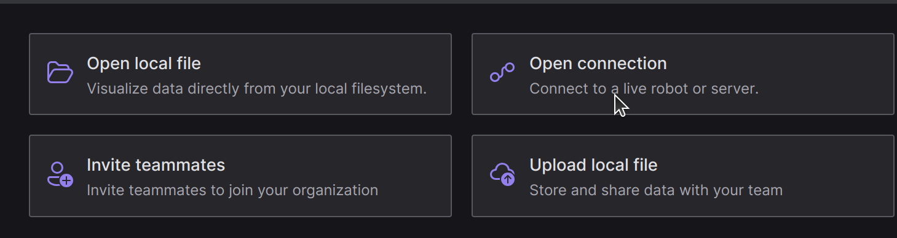


In the following popup, leave 'Foxglove Websocket' selected the default value of 'ws://localhost:8765' for the URL. Click 'Open'.

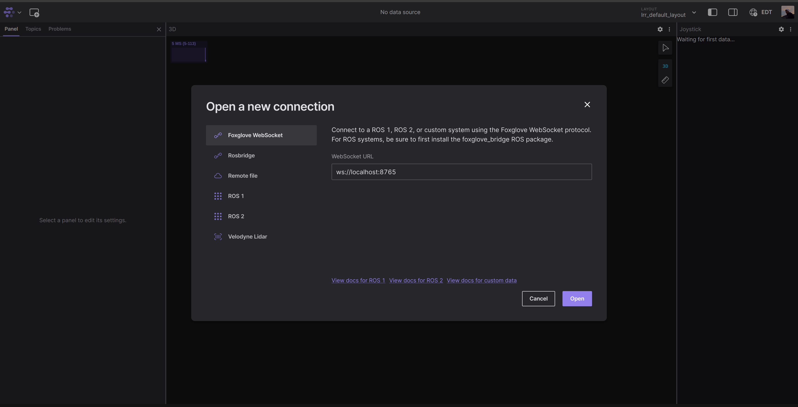


In the top right corner, find the button that says 'Layout' or 'Default'. In the drop-down, select 'Import From File...' then navigate to `src/mote_curriculum/hw1/mote_default_layout.json`.

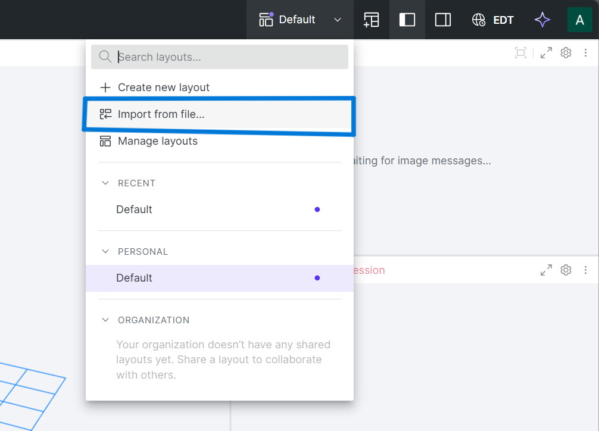


> **Tip:** A new layout file will be provided in the folder for each homework.

Be sure to enable "Apps on Device" for the website.

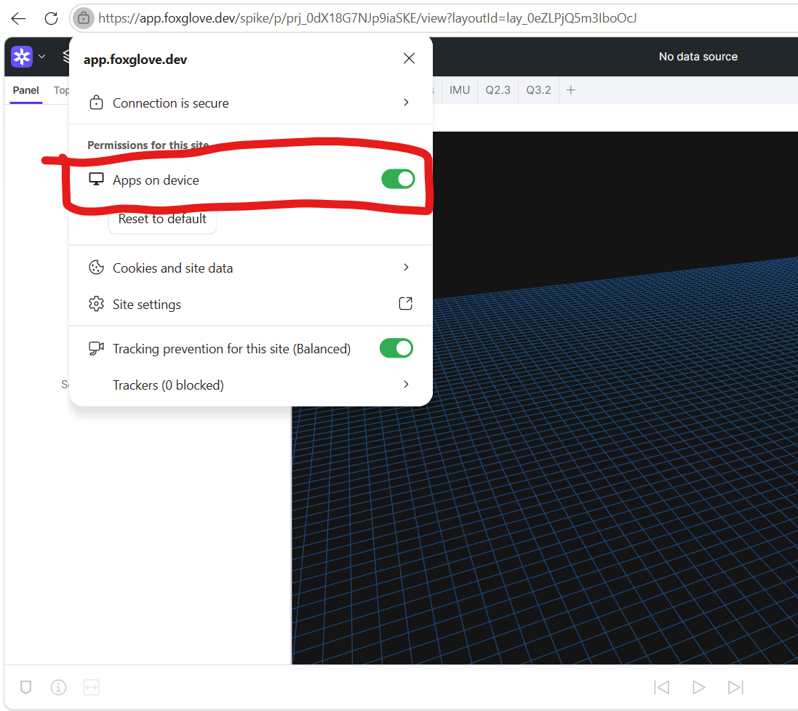

If all went well, you should see something like the following:

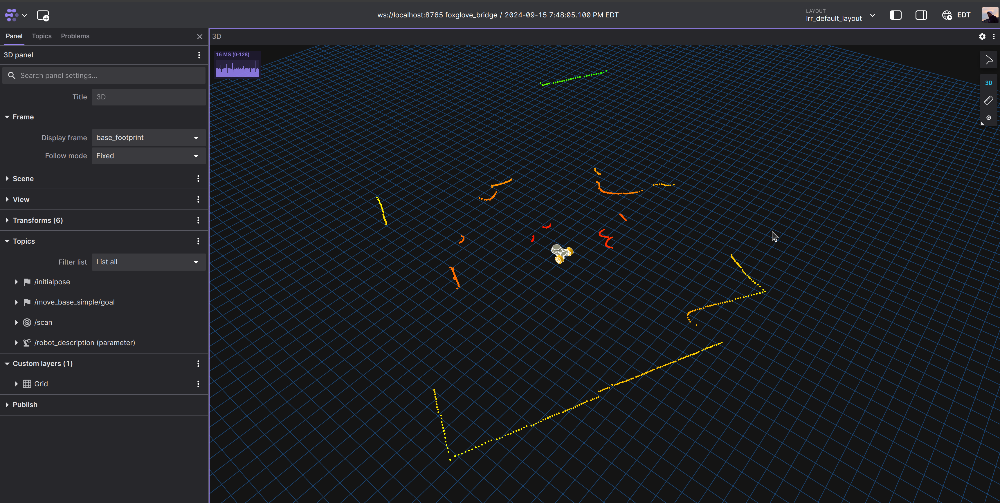

In the center is a model of the rover. The colorful dots are a laser scan from the LiDAR.
Try picking up the rover and moving it around, you should see the LiDAR readings change in real time.

Play around with Foxglove.
Add some panels, change some settings, plot some values, see what you can do.
To go back to the original layout, click revert:

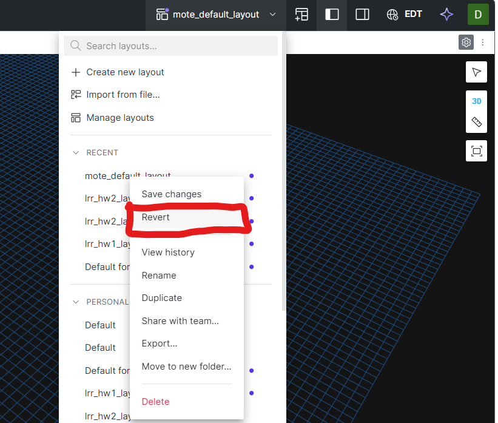


**(5 pts) Deliverable 3 Foxglove Visualization:** Take a screenshot of Foxglove showing the robot model and live LiDAR scan.

Save this screenshot in [Deliverable 3 in `writeup.md`](./writeup/writeup.md#deliverable-3-foxglove-visualization).

## Q3 Teleop

Then open a new terminal (while running the visualization), and run a teleop node:

```
rosrun teleop_twist_keyboard teleop_twist_keyboard.py _speed:=1.2 _turn:=2.0 _key_timeout:=0.6 cmd_vel:=/diff_drive_controller/cmd_vel
```

**This command will allow you to drive the robot using your keyboard.** Use the following keys to control the robot:

```
   u    i    o
   j    k    l
   m    ,    .
```

**If the battery isn't connected, the robot might not move.** Make sure to connect the battery to the robot before running the teleop node.

> **Note: What's going on here?**
>
> This command runs a node that converts key presses into a [ROS Twist message](https://docs.ros.org/en/melodic/api/geometry_msgs/html/msg/Twist.html). This message is published on the topic `/diff_drive_controller/cmd_vel`, where the rover is subscribed for teleop commands. In a third terminal, try running this command to see what the node is outputting:
> 
> ```rostopic echo /diff_drive_controller/cmd_vel``` 
>
> The command parameters adjust the linear and angular speeds for the robot, and `_key_timeout` makes the rover stop when you let go of the keys.

> **Tip:** To speed things up, try tweaking the parameters in the command.

**(15 pts) Deliverable 4 :** While driving the rover with the keyboard node, capture a screenshot of terminal output of rostopic echo on the correct teleop topic, showing live Twist messages.

Save this screenshot in [Deliverable 4 in `writeup.md`](./writeup/writeup.md#deliverable-4-teleop-topic-output).

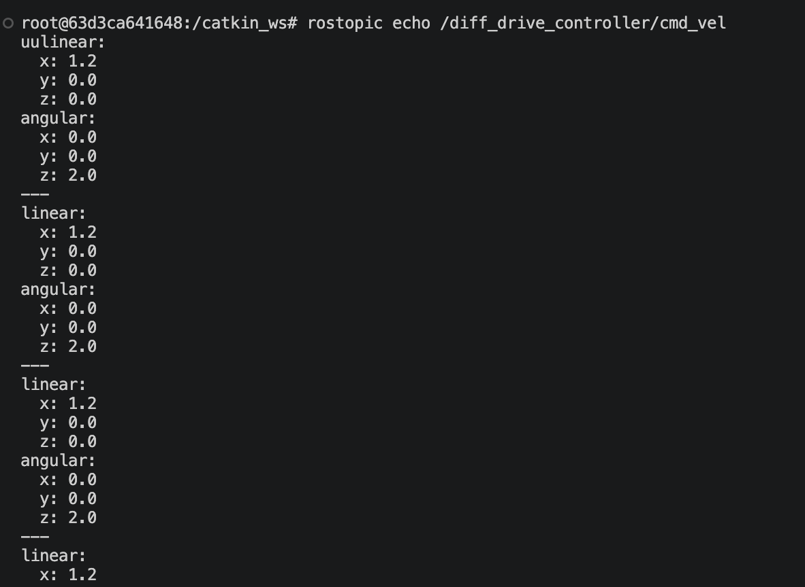

****

## Q4. Practicing ROS Nodes: prime number (40 pts)

> You can close the terminals running the visualization and teleop nodes for this section.

Recall that [publishers and subscribers](http://wiki.ros.org/rospy/Overview/Publishers%20and%20Subscribers) are how ROS manages interprocess communication. Publishers send out messages to a topic, while subscribers choose a topic to receive messages from. Publishers and subscribers can even be on different machines in a network, although we won’t take advantage of that feature in these projects.

We will be creating a simple ROS node that checks whether an input number is a prime number. It will read an input number from a ROS parameter and publish a boolean value (True, if input number is a prime number, or False, if not) to a ROS topic. For example, 7 is a prime number, and the publisher should publish True. 1234 is not a prime number, and the publisher should publish False.

**Q4.1**: Implement the `is_prime_number` function in `hw1/q4_prime_number/prime_number.py`. Make sure your implementation is correct before proceeding to the next question. Your code should pass all tests in `test_prime_number.py`.

To test your code, run
```
roscd hw1/q4_prime_number/
python3 -m tests.test_prime_number
```
<details>

<br>

<summary>Rubric</summary>
There are two tests in `test_prime_number.py`, each test is worth 5 points
</details>

<br>

**Q4.2**: We’ve provided an annotated code skeleton to interface with ROS at `hw1/q4_prime_number/prime_number`. Follow the instructions inline to complete the code. Your implementation should now also pass `rostest hw1 prime_number_small.test`.

> **Debugging:** A common practice for debugging code is using `print()` statements to display the values of variables or the flow of execution at specific points in the program. The output of these print statements will be visible on your terminal when you run `python` or `roslaunch` commands. However, they will not be visible on your terminal when you run `rostest` commands. You can find the output of your print statements by doing the following steps:
> 1. In a new terminal, do `cd ~/.ros/log/latest` 
> 2. You will find many pairs of files of the kind: {node_name}-{number}.log and {node_name}-{number}-stdout.log. Run `cat {node_name}-{number}-stdout.log`, where node_name is the python file with your print statements.

> **Common Problems:**
> <details>
> <summary>"FAILURE: Test node [hw1/test_prime_number_small.py] does not exist or is not executable" </summary>
>
> This is because you need to enable access to the said executable using chmod:
> ```
> roscd hw1/q4_prime_number/
> chmod +x tests/test_prime_number_small.py
> ```
> 
> Please do the same for other executables for which this error arises in the future.
> </details>
> 
> <details>
> <summary>"ERROR: The following tests failed to run: * testtest_prime_number_small" </summary>
>
> This is most likely because you are on a Windows machine. If you scroll up you should see something like
> ```
> /usr/bin/env: ‘python3\r’: No such file or directory
> /usr/bin/env: ‘python\r’: No such file or directory
> ```
> This is caused by Windows having different line endings compared to linux. When you create the docker container, the Windows line endings from your local computer carry over into the linux machine, causing the Python shebang to not get interpretted correctly. If you are using VS Code, you can switch the line endings by clicking the "CRLF" in the bottom right corner and then clicking "LF" in the new popup.
>
> 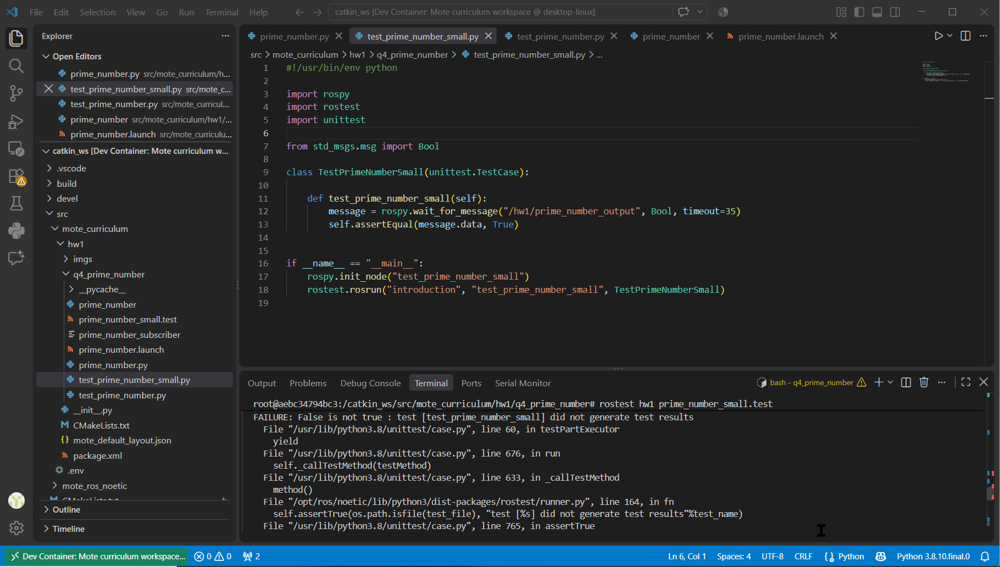
> 
> To pass `test_prime_number_small`, you will need to change the line endings of `tests/test_prime_number_small.py` and `prime_number`.
>
> Again, please do the same for other files for which this error arises in the future.
> </details>

<br>

<details>
<summary>Rubric</summary>
15 points for passing `prime_number_small.test`
 </details>

<br>

**Q4.3**: Finally, we will write a launch file for our node to make it easier to run, and provide different inputs to `is_prime_number`. Since `hw1/q4_prime_number/prime_number` reads the input from the "~test_number" parameter from ROS, you will need to pass it to your node in your launch file. We have provided an annotated skeleton in `hw1/q4_prime_number/prime_number.launch`. Follow the inline instructions to complete the launch file.


Let’s run the publisher node and see its output directly. Now, listen to the output topic. Then, start your prime number node using `prime_number.launch`. You should see the boolean value appear on the `/hw1/prime_number_output` topic in terminal 2! You can then run the prime number node with different input values. Here are the commands to run:
```
# In terminal 1 
rostopic echo /hw1/prime_number_output
# In terminal 2
roslaunch hw1 prime_number.launch
roslaunch hw1 prime_number.launch input_number:=11
roslaunch hw1 prime_number.launch input_number:=12
```

You can also run the automated test for the launch file:
```
roscd hw1/q4_prime_number/
rostest hw1 prime_number_launch.test
```

<details>
 <summary>Rubric</summary>
 5 points for passing `prime_number_launch.test`
 </details>

 <br>

 **Q4.4**: Now let's practice writing a *subscriber*. Subscribers listen for messages on a topic and run a callback function every time a new message arrives (see [publishers and subscribers](http://wiki.ros.org/rospy/Overview/Publishers%20and%20Subscribers) for a refresher).
 
Write a node at `hw1/q4_prime_number/prime_number_subscriber.py` that subscribes to the same topic your publisher publishes to (`/hw1/prime_number_output`). Every time a new message arrives, your callback should print and append the boolean value it received to `self.storage`.
 
Follow the inline instructions in `prime_number_subscriber` to complete the node. Then follow the inline instructions in `prime_number.launch` to launch your subscriber alongside the publisher.
 
To test it, run:
```
roslaunch hw1 prime_number.launch input_number:=21
```
You should see the publisher's boolean output, followed by that same value printed by your subscriber.

To run the automated subscriber test, run:
```
roscd hw1/q4_prime_number/
rostest hw1 prime_number_subscriber.test
```
 
<details>
<summary>Rubric</summary>
10 points for passing `prime_number_subscriber.test`
</details>

## Deliverables

Submit the complete [`writeup/`](./writeup/) directory, including
[`writeup.md`](./writeup/writeup.md) and its three image files.
 
1. **(20 pts)** Pass in-person assembly inspection — TAs will manually check assembly and run teleop.
2. **(5 pts)** Include your Mote configuration screenshot in [Deliverable 2 of `writeup.md`](./writeup/writeup.md#deliverable-2-mote-configuration-page), connected via RedRover Wifi, with all diagnostics items checked.
3. **(5 pts)** Include your Foxglove screenshot in [Deliverable 3 of `writeup.md`](./writeup/writeup.md#deliverable-3-foxglove-visualization), showing the robot model and live LiDAR scan.
4. **(15 pts)** Include your `rostopic echo` screenshot in [Deliverable 4 of `writeup.md`](./writeup/writeup.md#deliverable-4-teleop-topic-output), showing live Twist messages while driving the rover with the keyboard.
5. **(10 pts)** Implement `is_prime_number` so it passes both tests in `test_prime_number.py` (5 pts each).
6. **(15 pts)** Complete the `prime_number` node so it passes `rostest hw1 prime_number_small.test`.
7. **(5 pts)** Complete `prime_number.launch` so it passes `rostest hw1 prime_number_launch.test`.
8. **(10 pts)** Complete `prime_number_subscriber` so it passes `rostest hw1 prime_number_subscriber.test`.

## Submission

Submit one ZIP file containing the complete `hw1` folder to Gradescope. The
`hw1` folder must be the wrapper folder in the ZIP; do not submit only its
contents.

From the directory containing `hw1`, create the submission with:

```bash
cd /catkin_ws/src/mote_curriculum
zip -r hw1.zip hw1/
```

Before submitting, inspect the archive and confirm that it begins with the
`hw1/` directory:

```bash
unzip -l hw1.zip
```

At minimum, the submitted archive should contain:

```text
hw1/
├── CMakeLists.txt
├── package.xml
├── q4_prime_number/
│   ├── prime_number
│   ├── prime_number.py
│   ├── prime_number.launch
│   ├── prime_number_subscriber
│   ├── prime_number_subscriber.py
│   └── tests/
└── writeup/
    ├── writeup.md
    ├── mote-config.png
    ├── lidar-foxglove.png
    └── teleop-topic-echo.png
```

### Adding images to the writeup

Save all deliverable images in the `hw1/writeup/` folder. The provided
`writeup/writeup.md` already contains Markdown image links using the required
filenames. If you use a different filename, update the corresponding link with:

```markdown

```

Open `writeup/writeup.md` before submitting and verify that all three images
render correctly.
