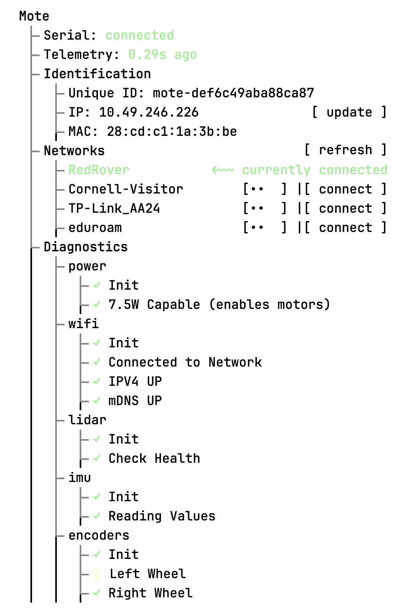
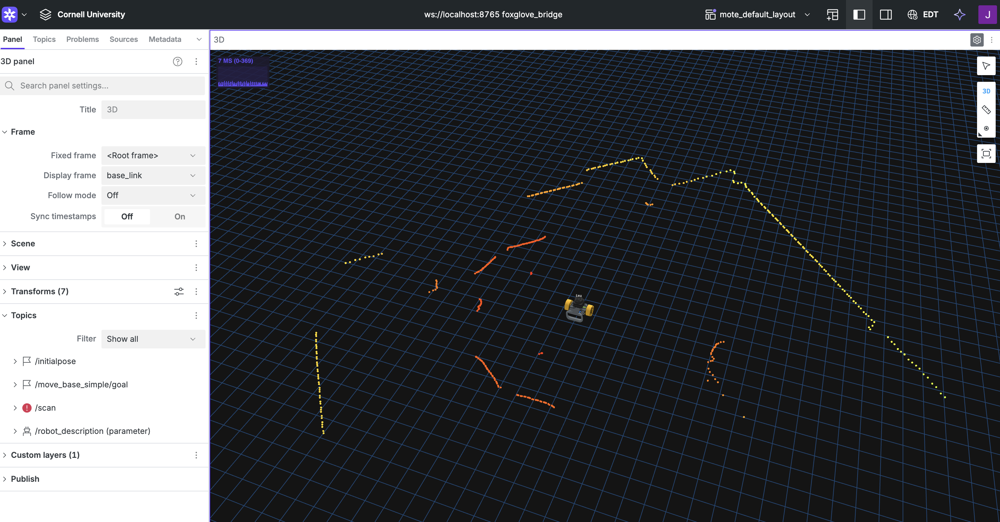
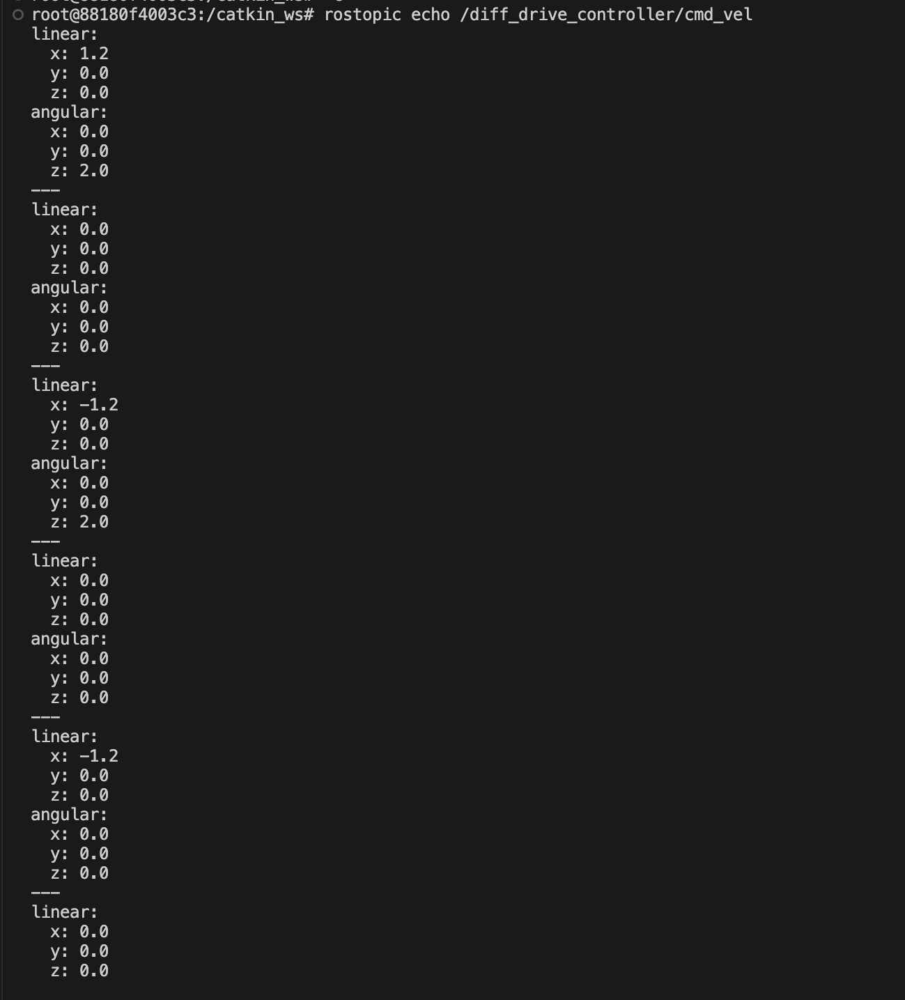

# HW 1 Writeup

Use this file for the screenshot deliverables. Save each screenshot in this `writeup/` directory.

## Deliverable 2: Mote Configuration Page

## Deliverable 3: Foxglove Visualization

## Deliverable 4: Teleop Topic Output

